# Data Matrix using 200 users only
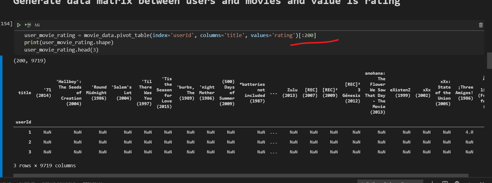

> ## **I replaced NAN Values with zero**
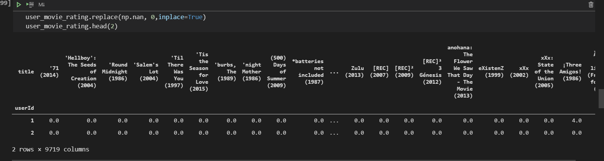

# Cosin similarity matrix implementation
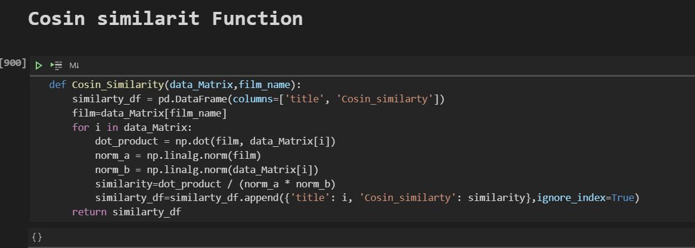

# Toy sory ratings by all users
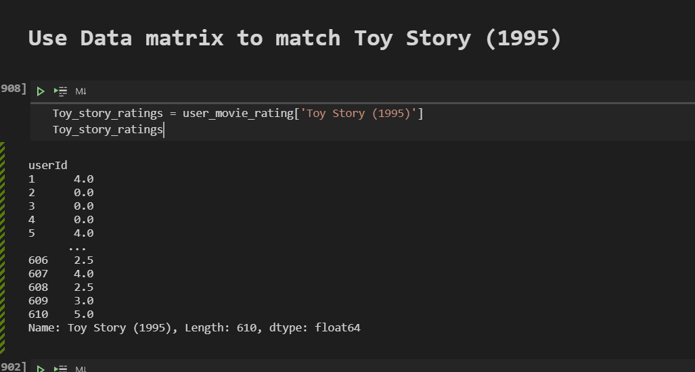
# I obtained  Movies like toy story using cosin similarity
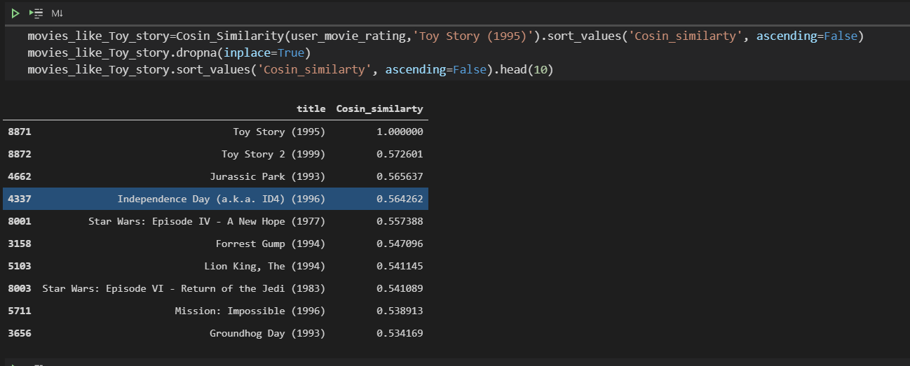
> ## **I droped all Nan values which is user didnt give rate to this movie**
> ## **The first top 10 movies similar to toy story**

# I joined rating count too to obtaind on movies similar to toy story and also rated by more than 100 users
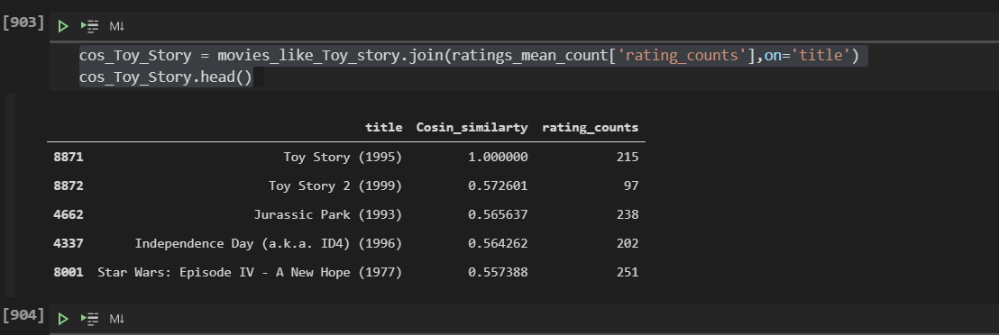
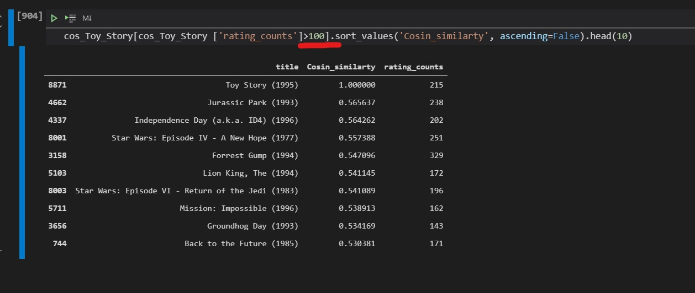

# I did the same steps to "Waiting to Exhale (1995)"
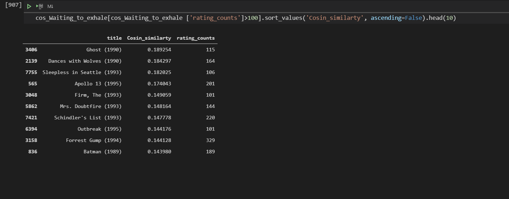

> ### **and these the first top movies similar to waiting to exhale and rated by more than 100 users**

# Part three
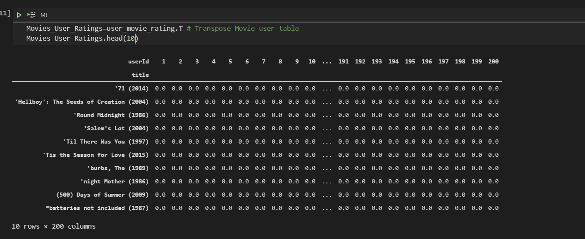

> ###  **I transposed Data Matrix. So each column is certain user with all rating that he gave to all movies in original data.**
> ###  **as i mentioned before i filled non rated film with zero to handle some calculations that i do to recommend similarties**

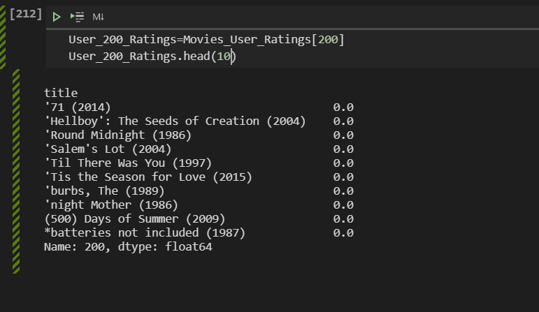

> ###  **Here all rated that user 200 gave to movies**

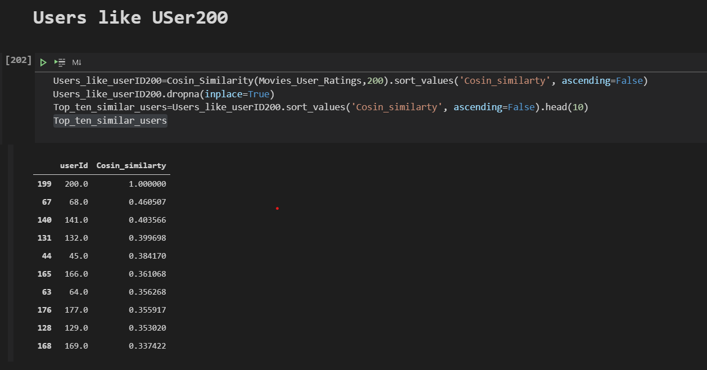

> ### **The Top ten similar users to users of ID 200**
> ### **I did the same process that i did in item based algorithm. by getting cosin similarity between users and sorted values of similarity asending to get the top ones**

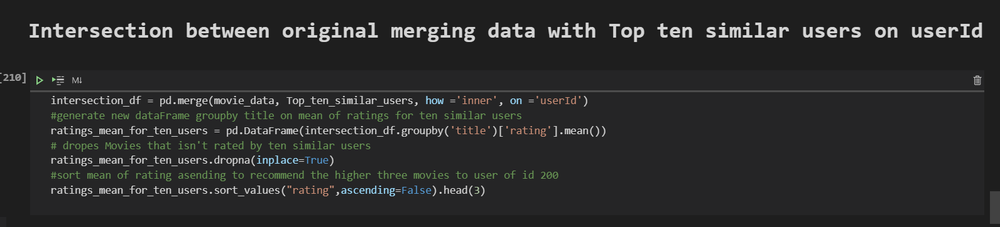

> ## **I did intersection between original movies data  and dataFrame of top ten similar users to get all rating and data for top ten similar useres only**

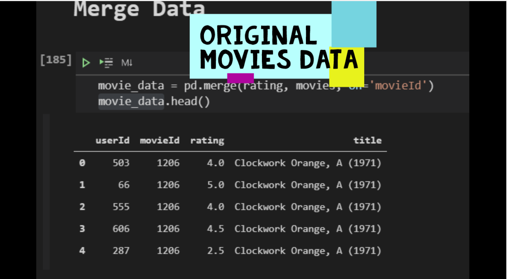
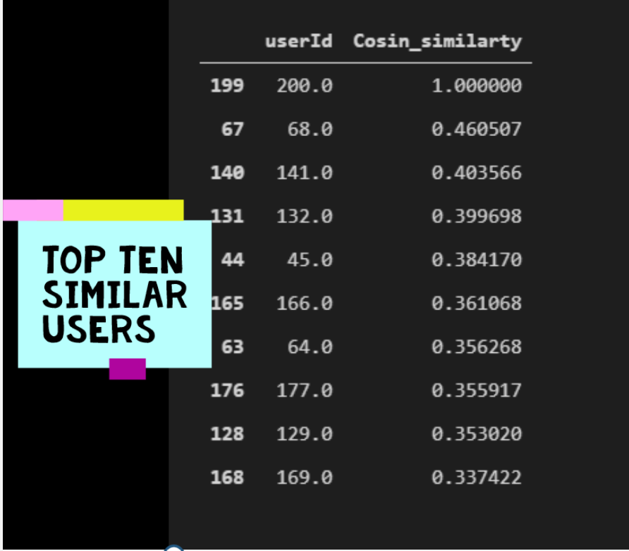

# Result 

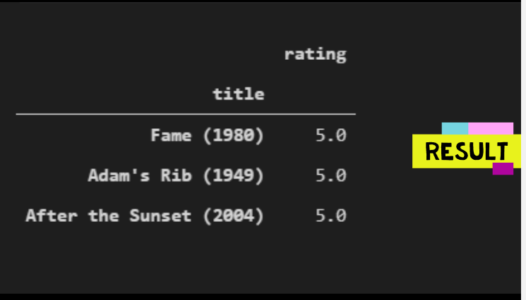

> # **These Three top movies that got higher rate by 10 similar users so recommeded them to user of id 200**